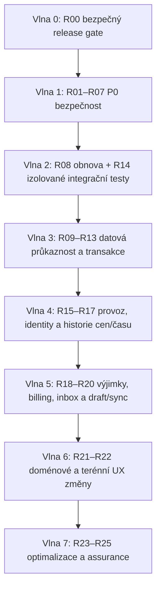

# FÁZE 7 – Jednotná remediation roadmapa

- **Auditovaná revize:** `a25c3128e317c7efe6feaa3a6a8a40eecd6cdc0f` (`main`).
- **Vstupy:** 84 nálezů FÁZÍ 1–6: 22 SEC, 13 GDPR, 13 COMP, 14 ROB, 8 TEST a 14 UX.
- **Výstup:** 26 neduplicitních workstreamů R00–R25, jejich závislosti a doporučené pořadí.
- **Hranice:** tento dokument nic neimplementuje. Odhady jsou relativní velikost změny, nikoli cenová nabídka ani kalendářní závazek.

## 1. Manažerské shrnutí

Nejbezpečnější cesta není zahájit velký redesign. Nejdříve je nutné vytvořit minimální izolovaný release gate, uzavřít cesty k převzetí účtu a obejití oprávnění, oddělit PWA data podle identity, ochránit uploady a privátní objekty a opravit průkaznost veřejných podpisových odkazů. Současně se musí prokázat úplná obnova DB i objektů.

Teprve na tomto základě má smysl zavádět durable audit/outbox, DB invarianty, účetní snapshoty, GDPR workflow a spolehlivý sync. Největší administrativní úspory – dokumentové batch review, jednotný inbox a sjednocení Projekt → Zakázka → Výjezd – jsou P2, protože bez bezpečnostních a datových základů by zrychlily i chybné či neprůkazné operace.

Roadmapa neznamená jeden release. R00–R07 se mají realizovat v malých izolovaných změnách s regresními testy. Každá migrace používá expand–migrate–contract, samostatný backfill, měření a předem ověřený návratový postup.

### Stav realizace po FÁZI 8.11

| Workstream | Stav              | Důkaz                                                                                                                                                                                                                                    | Zbývající hranice                                                                                                                                                                        |
| ---------- | ----------------- | ---------------------------------------------------------------------------------------------------------------------------------------------------------------------------------------------------------------------------------------- | ---------------------------------------------------------------------------------------------------------------------------------------------------------------------------------------- |
| R00        | Dokončeno lokálně | `f1bb210`, `2c660c1`; hermetický `pnpm gate:release` prošel 2026-08-01                                                                                                                                                                   | potvrdit první běh nového GitHub Actions workflow; rozšířený ephemeral DB/E2E stack patří do R14                                                                                         |
| R01        | Dokončeno lokálně | `da5e734`, `f5f6349`, `8ddea6d`, `b5ef912`, `bf18843`; izolovaný PostgreSQL test prokázal paralelní setup, rotaci cookie, revokaci dvou agents a odmítnutí znovuuložené staré session                                                    | před produkcí aplikovat migraci `0096`, připravit oznámení jednorázového odhlášení a sledovat 401/login chyby                                                                            |
| R02        | Dokončeno lokálně | `77422e6`, `8d3c4b9`, `96e5e96`, `cf34a09`, `fbff6fa`, `5b7dbb0`; 397 unikátních method/path registrací je generováno ze zdrojů a každá má explicitní public, authenticated-only nebo permission policy                                  | před produkcí read-only inventura legitimních tras/objektů, měřitelný rollout a monitoring nových `route_not_authorized` odpovědí                                                        |
| R03        | Dokončeno lokálně | `71bf9d8`, `7e9d819`, `45937f6`, `583eaa4`; identity partition a live scope kontrolu doplňuje atomický IndexedDB lease, durable serverový ledger pro všechny offline mutace, SHA-256 raw uploadů a řízené retry/conflict/ambiguous stavy | před produkcí aplikovat `0097`, nasadit server a frontend jako jeden řízený rollout; plný browser E2E se dvěma reálnými taby zůstává v R14                                               |
| R04        | Dokončeno lokálně | `63ba086`; auth před nákladným parsingem, pevné body/decompression limity, strukturální MIME validace, re-decode podpisů, scanner/quarantine hook, SHA-256 metadata a durable upload ledger `0098`                                       | před produkcí aplikovat `0098`, ověřit scanner a nasadit API+proxy koordinovaně; inventura, retence a orphan cleanup zůstávají v R12                                                     |
| R05        | Dokončeno lokálně | `5d1b041`; versioned authenticated envelope, dual-read, měřený backfill a šifrování nových DB záloh přes oddělený keyring                                                                                                                | před produkcí schválit key custody/DR, aplikovat `0099`, provést backfill, rotaci a úplný restore drill                                                                                  |
| R06        | Dokončeno lokálně | `b620014`, `a749475`, `fefc67e`; důvěryhodný veřejný origin, hash-only one-time tokeny, neměnné job/quote snapshoty a PDF hashe, atomické decision/signature eventy a korekční verze                                                     | před produkcí aplikovat `0101` a `0102`, oznámit zneplatnění legacy job/quote odkazů, ověřit object storage a provést řízený cutover; starým dokumentům nelze zpětně přisoudit neměnnost |

FÁZE 8.1–8.12 nic nenasadily ani neposlaly na remote. R05 a R06 jsou lokálně implementačně uzavřené. FÁZE 8.10 uzavřela hranici důvěryhodného veřejného originu, FÁZE 8.11 sjednotila lifecycle veřejných credentialů a FÁZE 8.12 svázala podpis zakázky i rozhodnutí o nabídce s neměnnou verzí, snapshotem a PDF hashem. R07 zůstává otevřený, proto celá FÁZE 8 ještě není dokončena. Podrobnosti a reprodukovatelné kontroly jsou v [08-phase-checkpoint.md](08-phase-checkpoint.md), [08-document-version-design.md](08-document-version-design.md), [08-secret-encryption-runbook.md](08-secret-encryption-runbook.md), [08-public-origin-runbook.md](08-public-origin-runbook.md) a [08-public-token-runbook.md](08-public-token-runbook.md).

## 2. Definice priorit

| Priorita                                              | Význam v této roadmapě                                                                                                                         |
| ----------------------------------------------------- | ---------------------------------------------------------------------------------------------------------------------------------------------- |
| **P0 – okamžitě**                                     | Riziko převzetí účtu, obejití oprávnění, úniku citlivých dat, podvržení dokumentu, zneužití uploadu nebo přehrání PWA dat pod jinou identitou. |
| **P1 – před dalším významným produkčním rozvojem**    | Obnova dat, audit/provenance, DB konzistence, lifecycle dokumentů, GDPR, testovací izolace, monitoring a spolehlivé externí integrace.         |
| **P2 – významné provozní a administrativní zlepšení** | Snížení večerní administrativy, dávkové zpracování, jednotný inbox, drafty a sjednocení pracovních modulů.                                     |
| **P3 – pozdější optimalizace**                        | Výkon po změření, hlasové vstupy, vizuální/accessibility polish a pokročilé assurance techniky.                                                |

## 3. Závislosti a pořadí vln

R00 je minimální prerequisite, nikoli záminka odložit P0. Plný testovací stack R14 může pokračovat souběžně po uzavření nejnebezpečnějších testovacích hranic. R21 nesmí začít, dokud nejsou hotové R08, R11, R13, R14, R17 a schválené mapování legacy `activities`.

## 4. Portfolio workstreamů

| ID  | Priorita | Workstream                                                       | Složitost | Migrace                       | Odstávka                  |
| --- | -------- | ---------------------------------------------------------------- | --------- | ----------------------------- | ------------------------- |
| R00 | P0       | Minimální izolovaný release gate                                 | M         | Ne                            | Ne                        |
| R01 | P0       | Účty, obnova hesla a session lifecycle                           | M         | Možná malá                    | Ne                        |
| R02 | P0       | Fail-closed autorizace a objektové vlastnictví                   | L         | Pravděpodobně                 | Ne plánovaná              |
| R03 | P0       | Identity-safe PWA cache a offline fronta                         | L         | Browser storage               | Ne                        |
| R04 | P0       | Request/upload/object-storage ochrana                            | L         | Možný metadata backfill       | Ne plánovaná              |
| R05 | P0       | Šifrování trezoru a provozních secretů                           | XL        | Ano                           | Možná krátká při cutoveru |
| R06 | P0       | Veřejné tokeny a neměnné podepisované snapshoty                  | XL        | Ano                           | Ne plánovaná              |
| R07 | P0       | Perimetr: CSP, dependencies, TLS a interní routy                 | M         | Ne                            | Ne                        |
| R08 | P1       | Úplná záloha a prokázaná obnova DB + objektů                     | L         | Ne produkční; izolovaná kopie | Ne                        |
| R09 | P1       | Durable audit, provenance a důkazní export                       | XL        | Ano                           | Ne plánovaná              |
| R10 | P1       | GDPR governance, DSAR, retence a incidenty                       | L/XL      | Ano                           | Ne plánovaná              |
| R11 | P1       | DB invarianty, optimistic locking a online migrace               | XL        | Ano                           | Možné krátké DDL okno     |
| R12 | P1       | Durable outbox a reconciler DB–storage–SMTP                      | XL        | Ano                           | Ne plánovaná              |
| R13 | P1       | Neměnný účetní a dokumentový lifecycle                           | XL        | Ano                           | Ne plánovaná              |
| R14 | P1       | Izolované DB/E2E/fault testovací prostředí                       | L         | Ne produkční                  | Ne                        |
| R15 | P1       | Monitoring, alerty, fronty a provozní incidenty                  | M/L       | Ne nebo malé metriky          | Ne                        |
| R16 | P1       | Offboarding a dočasný scoped externí přístup                     | L         | Ano                           | Ne                        |
| R17 | P1       | Historie času, sazeb, cen a korekcí                              | L/XL      | Ano                           | Ne plánovaná              |
| R18 | P2       | Konsolidovaný billing preview a document-level batch             | L/XL      | Pravděpodobně                 | Ne                        |
| R19 | P2       | Jednotný inbox výjimek s vlastníkem a SLA                        | L         | Ano                           | Ne                        |
| R20 | P2       | Obecné user-scoped drafty a sync/conflict model                  | XL        | Ano, DB + IndexedDB           | Ne                        |
| R21 | P2       | Projekt → Zakázka → Výjezd a ukončení `activities`               | XL        | Ano, vysoce riziková          | Možný řízený cutover      |
| R22 | P2       | Režim Na místě, progressive disclosure a reklamace               | L         | Možná                         | Ne                        |
| R23 | P3       | Výkon, indexy a worker/queue škálování                           | L         | Možné indexy                  | Možné krátké DDL okno     |
| R24 | P3       | Hlasová poznámka a accessibility/UI polish                       | M/L       | Možná pro média               | Ne                        |
| R25 | P3       | Pokročilé assurance: mutation, chaos a periodické security testy | M/L       | Ne                            | Ne                        |

## 5. P0 – okamžitě

### R00 – Minimální izolovaný release gate

- **Stav:** dokončeno lokálně ve FÁZI 8.1 (`f1bb210`, `2c660c1`); vzdálený CI běh zatím nepotvrzen.

- **Přínos:** každá P0 změna má reprodukovatelný typecheck, unit/contract testy, cílené auth testy a build bez produkčních secrets.
- **Riziko neprovedení:** bezpečnostní opravy mohou být nasazeny bez regresní ochrany nebo testy zasáhnou sdílenou DB.
- **Rozsah:** rozdělit API unit/DB příkazy, odstranit implicitní DB připojení, přidat root gate a zakázat produkční hostname/DB/bucket v test runneru.
- **Závislosti:** žádné; první úkol.
- **Složitost:** M.
- **Odstávka:** ne.
- **Migrace dat:** ne.
- **Změna uživatelského procesu:** ne; mění vývojový/release proces.
- **Doporučené pořadí:** 1; plný DB/E2E stack dokončí R14.
- **Hotovo když:** čisté prostředí bez `DATABASE_URL` spustí hermetický gate a DB test odmítne neizolovaný cíl.

### R01 – Účty, obnova hesla a session lifecycle

- **Stav:** dokončeno lokálně po FÁZI 8.2 (`da5e734`, `f5f6349`, `8ddea6d`, `b5ef912`, `bf18843`); produkční migrace a rollout zůstávají samostatně schvalovaným krokem.

- **Přínos:** brání převzetí administrátora a zajišťuje, že login/reset/deaktivace mají jednoznačný session stav.
- **Riziko neprovedení:** nízkoentropická obnova, session fixation a platné staré relace po změně credentialů.
- **Rozsah:** odstranit bezpečnostní otázky, použít administrátorem řízený nebo jednorázový recovery tok, regenerovat session ID, atomický bootstrap, global revoke při resetu/deaktivaci.
- **Závislosti:** R00.
- **Složitost:** M.
- **Odstávka:** ne; uživatelé mohou být záměrně odhlášeni.
- **Migrace dat:** možná malá (`sessionVersion`/recovery token metadata).
- **Změna uživatelského procesu:** ano, bezpečnější recovery a opětovné přihlášení.
- **Doporučené pořadí:** 2.
- **Hotovo když:** testy dokazují rotaci session, administrátorem řízený recovery a revokaci všech relací. Lokálně splněno včetně generation guardu proti souběžnému znovuuložení staré session; produkční rollout ještě neproběhl.

### R02 – Fail-closed autorizace a objektové vlastnictví

- **Stav:** dokončeno lokálně po FÁZI 8.5 (`77422e6`, `8d3c4b9`, `96e5e96`, `cf34a09`, `fbff6fa`, `5b7dbb0`). SEC-05, SEC-06, SEC-10 a SEC-22 jsou uzavřeny: trezor vyžaduje fail-closed session-bound password/WebAuthn step-up, generický download povolí jen přesnou DB referenci s oprávněním vlastní domény a všech 397 zdrojových API registrací má explicitní access policy. Necatalogovaná nebo neklasifikovaná route končí `403 route_not_authorized`.

- **Přínos:** permissions platí jednotně pro API, trezor i soubory a nelze stahovat data pouhou znalostí cesty.
- **Riziko neprovedení:** IDOR, obejití deny override a budoucí veřejná `/api/internal/*` route.
- **Rozsah:** centrální policy enforcement, route manifest default-deny, resource ownership/účel, vault step-up fail-closed, odstranit generický implicitní přístup k privátním objektům.
- **Závislosti:** R00; pro externisty později R16.
- **Složitost:** L.
- **Odstávka:** ne plánovaná; feature flag a permission shadow logs před enforcementem.
- **Migrace dat:** ve FÁZÍCH 8.4–8.5 nebyla potřeba; vlastnictví známých objektů se odvozuje z existujících přesných referencí. Případný indexový zásah se má řídit až produkčním měřením výkonu.
- **Změna uživatelského procesu:** minimální; některé dříve dostupné cesty budou správně odmítnuty.
- **Doporučené pořadí:** 3.
- **Hotovo když:** generovaná negativní matice dokazuje 401/403, deny override a wrong-owner chování pro všechny chráněné routy. Lokálně splněno ve FÁZI 8.5: generátor i nezávislý kontrakt pokrývají 397 registrací, odmítají duplicity, dynamické registrace a zastaralý manifest; izolovaná DB/API sada ověřila veřejnou PPE výjimku, authenticated-only self-service i default-deny near-miss routy.

### R03 – Identity-safe PWA cache a offline fronta

- **Stav:** dokončeno lokálně ve FÁZÍCH 8.6–8.7 (`71bf9d8`, `7e9d819`, `45937f6`, `583eaa4`). Server vydává neprůhledný scope identity/autorizační epochy, všechny API odpovědi mají `private, no-store`, service worker ukládá pouze explicitní same-origin field-work allowlist a IndexedDB v3 ukládá operace i blob pod vlastníka. Legacy v1 stores se nečtou ani nereplayují. Cross-tab lease s expirací dovolí flush jediné instanci; každá offline mutace nese stabilní idempotency key a server ji přijímá přes durable ledger s krátkou transakční advisory lock, heartbeat a fail-closed ambiguous stavem. Raw uploady vážou fingerprint na klientský SHA-256 ověřený po načtení těla. Klient rozlišuje auth, transient, conflict, permanent a ambiguous výsledky, používá nejvýše pět automatických pokusů s bounded backoffem a stejné durable ID ručně opakuje jen po transient chybě. SEC-08, SEC-09, GDPR-07, ROB-01 a ROB-02 jsou lokálně uzavřeny.

- **Přínos:** data jednoho uživatele se nezobrazí ani nepřehrají pod jiným účtem; replay je idempotentní.
- **Riziko neprovedení:** únik lokálních dat, mutace pod cizí identitou a duplicity při dvou tabech/retry.
- **Rozsah:** user/session scope cache i IndexedDB, logout purge/partition, idempotency key, lease mezi taby, bounded retry, session-expiry a service-worker-update testy.
- **Závislosti:** R00, R01; obecné drafty až R20.
- **Složitost:** L.
- **Odstávka:** ne.
- **Migrace dat:** ano v browser storage; staré neidentifikované fronty bezpečně karanténovat nebo odstranit, nikoli automaticky přehrát.
- **Změna uživatelského procesu:** ano, přesnější stav sync a možné jednorázové zrušení starých lokálních položek.
- **Doporučené pořadí:** 4.
- **Hotovo když:** logout/user switch a dva taby nemohou replayovat cizí/duplicitní operaci. Lokálně splněno kombinací identity partition, atomického IndexedDB lease race testu a skutečné PostgreSQL/API concurrency sady; plný Playwright scénář dvou reálných tabů a service-worker update zůstává průřezovým důkazem R14, nikoli otevřenou implementační mezerou R03.

### R04 – Request/upload/object-storage ochrana

- **Stav:** dokončeno lokálně ve FÁZI 8.8. Autentizace a route policy předcházejí nákladným parserům; uploady i e-mailové přílohy mají pevné limity, strukturální validaci a omezené rozbalování. Podpisové obrázky se skutečně dekódují a sanitizují. Office obsah vyžaduje scanner, generický upload má karanténu, SHA-256 provider metadata a durable stav/claim v aditivní tabulce `object_uploads`. Legacy objekty zůstávají kompatibilní a beze změny; úplný lifecycle/cleanup dokončí R12.
- **Přínos:** omezuje DoS, polyglot/ZIP útoky, falešné podpisové obrázky a orphaned soubory.
- **Riziko neprovedení:** vyčerpání paměti/disku, škodlivý obsah, neautorizovaný objekt a nekontrolovatelný storage růst.
- **Rozsah:** auth před velkým parsingem, streaming limity, decompression budget, MIME+magic validation, skutečné PNG ověření, quarantine/scanner hook, object checksum a upload status.
- **Závislosti:** R00, R02; lifecycle dokončí R12.
- **Složitost:** L.
- **Odstávka:** ne plánovaná.
- **Migrace dat:** možný metadata/checksum backfill; staré objekty se nemažou bez inventury.
- **Změna uživatelského procesu:** ano jen u odmítnutých/velkých souborů; UI musí vysvětlit limit a recovery.
- **Doporučené pořadí:** 5.
- **Hotovo když:** regresní sada odmítne oversized, zip bomb, spoofed MIME/signature a nedokončený upload nezůstane bez evidence. Lokálně splněno ve FÁZI 8.8; nedokončený nový generický upload zanechá ledgerový stav a objekt nelze atomicky claimnout bez správného vlastníka a stavu.

### R05 – Šifrování trezoru a provozních secretů

- **Stav:** dokončeno lokálně ve FÁZI 8.9 pro nové zápisy, čtení legacy dat, bezpečný re-encryption backfill a šifrované DB zálohy. Produkční klíče, migrace, backfill, deploy ani restore nebyly provedeny. Provozní přechod zůstává podmíněn schváleným key custody/DR postupem a ověřením na produkční kopii.
- **Přínos:** kompromitace DB/dumpu sama neodhalí zákaznické přístupy, SMTP/IMAP ani API klíče.
- **Riziko neprovedení:** jeden dump poskytne přímý přístup k dalším systémům a zákaznickým zařízením.
- **Rozsah:** envelope encryption, externí master key/KMS, versioned ciphertext, dual-read migrace, key rotation, redakce logů a oddělené backup keys.
- **Závislosti:** R00; předem potvrdit KMS/DR vlastnictví.
- **Složitost:** XL.
- **Odstávka:** bez odstávky při dual-read/backfill; krátké maintenance okno pouze pokud stávající formát nelze bezpečně přepnout online.
- **Migrace dat:** ano, citlivý re-encryption backfill s počty a rollbackem bez plaintext exportu.
- **Změna uživatelského procesu:** minimální; administrátor musí spravovat recovery/rotation runbook.
- **Doporučené pořadí:** 6; rozdělit na KMS, aplikační dual-read, backfill, cutover a rotaci.
- **Hotovo když:** DB dump bez externího klíče neobsahuje použitelný secret a obnova/rotace je otestovaná. Lokální implementační část je splněna ve FÁZI 8.9; produkční uzavření vyžaduje nakonfigurovat oddělené keyringy, aplikovat `0099`, provést měřený backfill, vytvořit novou šifrovanou zálohu a úspěšně ji obnovit v izolovaném prostředí.

### R06 – Veřejné tokeny a neměnné podepisované snapshoty

- **Stav:** lokálně dokončeno ve FÁZÍCH 8.10–8.12. SEC-12 a SEC-18 kryje důvěryhodný origin a jednotný hash-only lifecycle. SEC-14, COMP-02 a COMP-07 kryjí neměnné job/quote verze, canonical snapshot SHA-256, hash skutečných PDF bytů, DB append-only eventy a atomický consume. UX-09 má explicitní opravu novou verzí bez přepsání původního důkazu. GDPR-11 je splněn v minimalizaci credentialů; obecná retence metadat a privacy logy zůstávají samostatně v R10/R12.
- **Přínos:** veřejné odkazy jsou revokovatelné a podpis dokládá přesnou verzi dokumentu.
- **Riziko neprovedení:** dlouhodobě použitelný bearer link, Host-header poisoning, accept/reject race a změna obsahu po podpisu.
- **Rozsah:** jednotný token service (hash, účel, expirace, one-time transition, revoke), trusted public base URL, immutable document version/hash/PDF a korekční verze/storno.
- **Závislosti:** R00, R02, R04; auditní evidence dokončí R09/R13.
- **Složitost:** XL.
- **Odstávka:** ne plánovaná; podporovat přechod starých tokenů s krátkým sunsetem.
- **Migrace dat:** ano; token metadata, snapshoty/verze a bezpečné označení legacy záznamů bez zpětného tvrzení neměnnosti.
- **Změna uživatelského procesu:** ano, znovuodeslání/revokace odkazu a explicitní nová verze po opravě.
- **Doporučené pořadí:** 7.
- **Hotovo když:** podpis/quote transition je atomický, link lze revokovat a hash podepsaného artefaktu je ověřitelný. Lokálně prokázáno migrací 102/102 na čistém PostgreSQL, trigger tamper testy, job/quote integračními závody a kontrakty ve FÁZI 8.12; produkční rollout je vědomě mimo auditní běh.

### R07 – Perimetr: CSP, dependencies, TLS a interní routy

- **Stav:** lokálně dokončeno ve FÁZI 8.13. Webový nginx i API mají fail-closed CSP/anti-framing hlavičky, SMTP a IMAP vyžadují ověřené TLS 1.2+ a STARTTLS tam, kde nejde o implicitní TLS, CSV exporty neutralizují formule i po počátečních whitespace/control znacích a produkční dependency audit nemá žádný High nález. Přesná veřejná výjimka, vlastní limiter a timing-safe bearer kontrola interní backup routy byly již pokryté dřívější opravou R02 a byly znovu ověřeny.
- **Přínos:** zmenšení snadno zneužitelného povrchu bez velkého doménového redesignu.
- **Riziko neprovedení:** framing/XSS dopad, známé zranitelnosti, downgrade SMTP/IMAP a fail-open budoucí routy.
- **Rozsah:** CSP/frame-ancestors/security headers, dependency aktualizace po balíčcích, STARTTLS/CA fail-closed, explicitní interní router auth, CSV formula neutralizace.
- **Závislosti:** R00; SMTP state machine později R12.
- **Složitost:** M.
- **Odstávka:** ne, rolling release.
- **Migrace dat:** ne.
- **Změna uživatelského procesu:** ne; může vyžadovat aktualizaci starého mail serveru/prohlížeče.
- **Doporučené pořadí:** 8, ale izolované dependency/security-header opravy lze vydat dříve po R00.
- **Hotovo když:** produkční headers, dependency scan, TLS contract a CSV testy procházejí. Lokálně prokázáno čistou instalací opravených verzí, auditem bez High, 67/67 API security/XML kontrakty, 6/6 frontend CSV testy, oběma typechecky a produkčními API + Vite/PWA buildy ve FÁZI 8.13; produkční rollout zůstává mimo auditní běh.

## 6. P1 – před dalším významným produkčním rozvojem

### R08 – Úplná záloha a prokázaná obnova DB + objektů

- **Přínos:** doložené RPO/RTO pro celý systém, ne jen část PostgreSQL.
- **Riziko neprovedení:** úspěšný DB restore bez fotografií, dokumentů a podepsaných PDF; falešný stav `ok`.
- **Rozsah:** off-site/versioned DB i object backup, manifest/checksum, nezávislý účet, restore exit-code hardening, business smoke a čtvrtletní drill/runbook.
- **Závislosti:** R00, inventura storage z R04; před každou další datovou migrací.
- **Složitost:** L.
- **Odstávka:** ne pro zálohu/drill; reálný disaster restore má plánované maintenance podmínky.
- **Migrace dat:** ne produkční; restore test vytváří izolovanou kopii.
- **Změna uživatelského procesu:** ne; provozní vlastník musí potvrzovat drill.
- **Doporučené pořadí:** 9.
- **Hotovo když:** čisté izolované prostředí obnoví DB+objekty, ověří checksumy a projde reprezentativní workflow v cílovém RTO.

### R09 – Durable audit, provenance a důkazní export

- **Stav auditu 2026-08-11:** **NOT READY.** Obecný audit zůstává post-commit best-effort, mutable a bez canonical envelope, integrity a ověřitelného exportu. Centrální registr a pořadí opravy: `17-c-p1-core-closure-checkpoint.md`.
- **Lokální R09-A 2026-08-11:** strict canonical envelope/projection/action-policy kontrakt a 35 cílených testů jsou připraveny bez DB wiring. Každá kritická action je allowlistově svázána s entity, source/actor/authentication, reason/lifecycle a doménovými artifacts. Samotný leaf hash není chain a produkční audit zůstává NOT READY; checkpoint `17-e-wave1-contract-and-containment-checkpoint.md`.
- **Lokální R09-B 2026-08-11:** strict global stream/sequence/previous-ledger chain record, canonical export-outbox intent a transakční repository interface jsou připraveny bez DB schema a bez migračního čísla. Cílený R09-A/B výsek prošel 40/40; skutečné tabulky, transakční adapter, dual-write, export worker a offline bundle verifier zůstávají otevřené.
- **Lokální R09-C 2026-08-11:** generic best-effort middleware je nově metadata-only a do `audit_log.summary` ukládá pouze redigovanou metodu a cestu; request body se neukládá ani přes denylist. Explicitní transakční doménové audity zůstávají beze změny. Cílený kontrakt prošel 24/24; atomicita, immutable event stream a export zůstávají otevřené. Checkpoint `17-ao-r09-generic-audit-minimization-checkpoint.md`.
- **Přínos:** významná změna má dohledatelného aktéra, zdroj, před/po, důvod a vazbu na immutable artefakt.
- **Riziko neprovedení:** best-effort log selže spolu s requestem, obsahuje nadbytečná data nebo neprokáže AI/automatickou změnu.
- **Rozsah:** transakční audit/outbox, canonical event envelope, redakce, hash chain/externí export, provenance AI/importů a autoritativní serverové vault events.
- **Závislosti:** R05 pro citlivá pole, R06 pro verze, R11 pro transakční hranice.
- **Složitost:** XL.
- **Odstávka:** ne při expand-contract.
- **Migrace dat:** ano; nová audit/event tabulka a backfill pouze označených legacy metadat, ne domyšlené historie.
- **Změna uživatelského procesu:** ano u korekcí – povinný důvod u právně/účetně významných změn.
- **Doporučené pořadí:** 10–12 souběžně s R11/R13 po návrhu event modelu.
- **Hotovo když:** kritické operace mají atomický event a důkazní export ověří integritu bez citlivého payloadu.

### R10 – GDPR governance, DSAR, retence a incidenty

- **Stav auditu 2026-08-11:** **NOT READY / ČÁSTEČNÝ LOKÁLNÍ CONTAINMENT.** R10-A fail-closed middleware nyní před prvním side effectem odmítá `/gdpr/erase` a přímé hard-delete routy customer/contact/site/person s `409 privacy_case_required`; starý ani upravený klient nemá bypass a UI tyto přímé akce nenabízí. Současný export je však neúplný a neexistuje privacy case, identity verification, legal hold, retention matrix, durable DB–storage/provider plán ani reconciled evidence výsledku. Právní hodnoty zůstávají `DECISION_REQUIRED`; centrální registr: `17-c-p1-core-closure-checkpoint.md`.
- **Přínos:** práva subjektů a mazání se provádějí řízeně, úplně a s právním holdem.
- **Riziko neprovedení:** neúplný export, destruktivní výmaz účetních/BOZP důkazů, neurčené retence a zmeškání 72hodinového incidentního procesu.
- **Rozsah:** ROPA/procesor registry, účely/tituly, data inventory, DSAR case, access/export/restrict/erase/anonymize, legal hold, retention jobs, breach register/runbook.
- **Závislosti:** právní/účetní/BOZP rozhodnutí; R05, R08, R09, R13 a R16.
- **Složitost:** L/XL podle schválených pravidel.
- **Odstávka:** ne plánovaná.
- **Migrace dat:** ano pro request/hold/retention metadata; historický backfill opatrně.
- **Změna uživatelského procesu:** ano, řízené žádosti místo přímého erase a schvalování výjimek.
- **Doporučené pořadí:** 13; governance rozhodnutí začít dříve, automatické mazání až po R08/R13.
- **Hotovo když:** testovací subjekt má úplný export a každá delete/anonymize akce má policy, hold check a důkaz výsledku.

### R11 – DB invarianty, optimistic locking a online migrace

- **Stav auditu 2026-08-11:** **NOT READY.** Chybí jednotný row-version/ETag kontrakt, DB live billing claim, kanonický lock order a oddělený bounded migration/backfill plane. Centrální registr: `17-c-p1-core-closure-checkpoint.md`.
- **Lokální R11-B 2026-08-11:** A↔B warehouse rematch používá vzestupný `FOR NO KEY UPDATE` lock order a izolovaný PostgreSQL 16 concurrency test prošel 11/11. Same-source serializace zůstává otevřená: bezpečné řešení musí před prvním reconcile naplánovat společné pořadí source i item locků pro celou vyšší transakci; izolovaný advisory lock uvnitř jednoho volání by mohl pouze přesunout deadlock mezi více source. Nonnegative policy, row versions, live billing claim a migration plane také zůstávají otevřené.
- **Lokální R11-C 2026-08-11:** šest external-account lifecycle mutací má explicitní stabilní online idempotency scope, vault step-up před ledgerem, authenticated `mve1` request/replay metadata a klientský same-key retry s fail-closed reconciliation UX. DB test prošel 9/9 a frontend kontrakt 6/6. Ostatní online mutace, row versions, claims a migration plane zůstávají otevřené.
- **Lokální R11-D 2026-08-11:** `reconcileSourceMovements()` po vzestupném item prelocku znovu načte append-only ledger stejného source. Nový target, který nebyl v chráněné množině, skončí fail-closed konfliktem 409; opakování z nové transakce načte úplnou množinu a konverguje bez dvojího výdeje. Disposable PostgreSQL 16 warehouse suite prošla 12/12. Globální planner pro vyšší transakce s více různými reconcile calls, row versions, live billing claim a migration plane zůstávají otevřené. Checkpoint `17-ap-r11-same-source-reconcile-containment.md`.
- **Lokální R11-E 2026-08-11:** každý běžný záporný warehouse delta po item locku přepočítá authoritative stav přímo z append-only ledgeru a odmítne 409, pokud by výsledek klesl pod nulu. Platí to pro ruční výdej, zakázkové/activity materiály i reversal příjmu; doménová transakce se při odmítnutí celá rollbackne. Dva souběžné ruční výdeje se serializují a uspěje jen množství kryté zásobou. Disposable PostgreSQL 16 suite prošla 16/16. Controlled override zatím záměrně neexistuje: bez zvláštní role, povinného důvodu, limitu a immutable `warehouse.override` eventu zůstává fail-closed. Checkpoint `17-aq-r11-nonnegative-stock-invariant.md`.
- **Lokální R11-F 2026-08-11:** nový `reconcileSourceMovementBatch()` nejprve objeví sjednocení všech itemů pro celý batch, zamkne je jednou ve vzestupném pořadí a teprve potom čte applied sums a zapisuje pohyby v původním source pořadí. Cost-document stock receipts/reversals už používají tento batch místo per-line loopu. Deterministický opposite-order test dvou multi-source transakcí prošel; disposable PostgreSQL 16 suite je 17/17. Ostatní vyšší cost-document/bulk cesty s několika oddělenými reconcile fázemi ještě vyžadují převod na jeden předem naplánovaný batch. Checkpoint `17-ar-r11-warehouse-batch-lock-planner.md`.
- **Přínos:** kritická business pravidla drží i při souběhu, retry a více instancích.
- **Riziko neprovedení:** last-write-wins, dvojí billing, záporný sklad, nekonzistentní stav a startup DDL lock.
- **Rozsah:** verze řádků/ETag, unique/check constraints, atomické transitions, idempotency registry, explicitní lock order, expand-contract migrace a velkoobjemové testy.
- **Závislosti:** R00, R08, R14; doménové invarianty schválit před DDL.
- **Složitost:** XL.
- **Odstávka:** bez odstávky pro většinu změn; možné krátké DDL okno u validace constraintu/index cutoveru.
- **Migrace dat:** ano, více malých migrací a backfillů.
- **Změna uživatelského procesu:** ano, konflikt se zobrazí místo tichého přepsání.
- **Doporučené pořadí:** 10–14 po doménách; fakturace/podpis/sklad před obecnými editacemi.
- **Hotovo když:** concurrency testy dokazují jediný authoritative výsledek a online migration runbook je otestovaný.

### R12 – Durable outbox a reconciler DB–storage–SMTP

- **Stav auditu 2026-08-11:** **NOT READY / LOKÁLNÍ KONTRAKT A INVENTURA.** R12-A definuje strict canonical intent, projection a append-only transition event pro delivery, managed-object write/delete a inbox reservation. R12-B přidává minimální rozhraní pro atomické vložení intentu/projekce a event/CAS přechodu uvnitř již otevřené doménové transakce; samo neexponuje commit, rollback, obecný DB klient ani provider. Exact drift registr nyní fail-closed hlídá 13 syntaktických delivery/provider volání, 45 běžných object write/delete volání a dvě odděleně evidenčně svázaná recovery-stream volání. Běžných 58 callsiteů zatím zůstává `legacy-unbound`, bez durable DB implementace, workeru, reconcileru a operator repair surface. Centrální registr: `17-c-p1-core-closure-checkpoint.md`.
- **Přínos:** přerušení mezi DB, objektem a e-mailem má dohledatelný a bezpečně opakovatelný stav.
- **Riziko neprovedení:** orphaned objekty, DB záznam bez souboru, duplicitní/nezjistitelný e-mail a ruční hádání výsledku.
- **Rozsah:** outbox/inbox state machine, stable idempotency/message IDs, storage staging/finalize, reconciler, dead-letter, operator retry a delivery telemetry.
- **Závislosti:** R04, R09, R11, adapter fault testy R14.
- **Složitost:** XL.
- **Odstávka:** ne při dual path/feature flag.
- **Migrace dat:** ano; outbox/object-state tabulky a inventura orphanů bez automatického mazání.
- **Změna uživatelského procesu:** ano, stav `čeká/neznámé/selhalo/doručeno` a bezpečný retry.
- **Doporučené pořadí:** 14–15; nejdříve podpisové a fakturační e-maily, poté ostatní integrace.
- **Hotovo když:** kill test v každém mezikroku skončí konzistentním stavem nebo viditelnou repair položkou.

### R13 – Neměnný účetní a dokumentový lifecycle

- **Stav auditu 2026-08-11:** **NOT READY / LOKÁLNÍ CONTAINMENT, CANONICAL, PERSISTENCE A DEFAULT-DARK LIFECYCLE/CORRECTION/DISPOSITION/PRICE CALLERS.** R13-A pod řádkovým zámkem odmítá `splitLine` i hard delete schváleného cost documentu. R13-B zakazuje destruktivní přepis platebního důkazu a R13-C blokuje přímé storno zaplacené faktury bez correction chainu. R13-D0–D3 lokálně definují strict immutable version/event/relation kontrakt, caller-owned DB adapter, additive nečíslovanou SQL šablonu a offline ověřitelný archive bundle s bounded workerem. R13-D4 zapojuje `issueInvoice`, R13-D5 `approveDocument`, R13-D6 `cancelInvoice` a R13-D7 odděluje `updateInvoiceStatus` i `confirmBankPayments` do lifecycle/payment persistence cest, každou za exact default-dark feature flagem. Issue/approve používají initial version + event + export intent + head CAS; cancellation vytváří version 2 `cancellation_notice`, deterministický PDF artifact, `voids` relation a atomicky ekvivalentní `void_confirmed` event. D7 ukládá `sent` pouze jako lifecycle event a přijetí platby pouze jako samostatný payment event; bankovní potvrzení ukládá hash normalizovaného confirmation source, nikoli raw bankovní data. R13-D8 za šestým exact flagem umožní nativně verzovaný approved cost document vrátit pouze do `needs_review` s povinným důvodem, přidá `review_reopened` event a při následném schválení vytvoří version N+1 `correction`, `supersedes` relation a `correction_linked` event. Původní verze se nemění. D9A–D9G lokálně definují, persistují a archivují version-bound warehouse-price observation, explicit-currency shadow projection bez FX a bounded projection-aware read-only DB parity audit. D9H/D9I implementují volby 1A/2A: oddělený retention-limited early discard a reviewed immutable `discarded_observation` s restricted reason artifactem. D9J atomicky váže explicitní price action a correction reopen na observation/outbox/shadow projection, ale zůstává default-dark. D9K–D9O přidávají exact-hash read-only plán, transaction-only apply primitive, raw approval, staging activation-preflight, source/before/after receipt, bounded offline verifier a fail-closed capture/abort runbook; legacy item má nejvýše jednu `legacy_observation` s `historicalCompleteness = unknown` a bez vymyšleného actor/effective/event řetězce. Jde stále o nepublikovaný lokální celek: chybí runner, číslovaná migrace, skutečný warehouse-price bootstrap/backfill a read cutover, partial/refund/reversal command paths, UI disposition cutover, Hetzner provider capability preflight/adapter a runtime aktivace workeru. Centrální registr: `17-c-p1-core-closure-checkpoint.md`.
- **Lokální R13-D2 expand vrstva 2026-08-11:** `AccountingAggregateStateV1` má explicitní monotónní revision a každá atomická operace ji posune právě jednou na každý změněný root. Drizzle model obsahuje šest additive tabulek pro version/lifecycle/payment/relation/outbox/head a konkrétní adapter pracuje výhradně uvnitř caller-owned transakce. Nečíslovaná SQL šablona přidává `ON DELETE RESTRICT`, canonical-envelope identity CHECKy, append-only triggery, root/version binding a exact revision+1 head guard. Šablona není v `lib/db/migrations`, nebyla nasazena ani přidělena migrace; route cutover, exporter/verifier, backfill a fault cutover testy zůstávají P1. R13-D0–D2 cílené unit kontrakty prošly 39/39, izolovaná SQL/adapter sada 5/5 a celý API unit/contract 726/726; API typecheck, lint a produkční build prošly.
- **Lokální R13-D3 archivní vrstva 2026-08-11:** canonical bundle + GNU checksum + manifest commit marker exactně vážou export intent a jeho immutable evidence. Lease worker používá `SKIP LOCKED`, bounded retry/dead-letter, content-addressed create-only storage port, provider `VersionId` read-back a CAS completion; partial write i lost lease jsou idempotentní. Outbox trvale ukládá manifest key/version a tři digesty a terminální receipt je DB-immutable. Offline CLI ověřuje všechny raw bytes proti schválenému receipt. Worker ani provider adapter nejsou aktivovány, Hetzner S3 nebyl kontaktován a SQL zůstává nečíslovanou šablonou; cost-document reopen/correction, partial/refund/reversal payment cesty, migrace, legacy backfill a storage capability preflight zůstávají P1.
- **Lokální R13-D4 issued-invoice seam 2026-08-11:** `issueInvoice` po finálním přepočtu a customer/supplier snapshotu vytváří deterministic version ID, rendered-PDF content/location digest, úplnou leaf provenance, sequence-zero `issued` event, export intent a aggregate head transition uvnitř stejné caller-owned transakce. Evidence persistence proběhne před PDF uploadem; fault test dokazuje rollback faktury i číselné řady a nulový upload při odmítnutí outbox insertu. Exact `ACCOUNTING_ISSUE_INVOICE_DUAL_WRITE_ENABLED=true` je jediná aktivační hodnota a default zůstává dark. Bez číslované migrace se flag nesmí zapnout; žádný env, deploy, S3 ani produkční/staging zápis nebyl změněn.
- **Lokální R13-D5 approved-cost-document seam 2026-08-11:** `approveDocument` vytváří canonical approved snapshot headeru, ordered lines, totals, references a source-file artifactů s AI/ISDOC/e-mail/human `sourceTrace`, sequence-zero `approved` event, export intent a aggregate head ve stejné transakci jako schválení. Raw AI payload ani sourceRef se do evidence neukládají. Exact `ACCOUNTING_APPROVE_DOCUMENT_DUAL_WRITE_ENABLED=true` je default-dark; evidence-backed replay musí mít shodný version hash, legacy approved row bez nativní evidence se nesmí přepsat na falešnou historii a reopen je do correction chainu odmítnut. Fault/tamper/dark-gate DB sada prošla 3/3; žádný env, deploy, S3 ani migrace nebyly změněny. Checkpoint: `17-j-r13-d5-approved-cost-document-dual-write-checkpoint.md`.
- **Lokální R13-D6 cancellation seam 2026-08-11:** `cancelInvoice` za exact `ACCOUNTING_CANCEL_INVOICE_DUAL_WRITE_ENABLED=true` vyžaduje nativní issued head a vytváří version 2 `cancellation_notice`, vlastní deterministický PDF artifact, `voids` relation a `void_confirmed` event ve stejném correction bundle. Původní issued version se nemění; `invoices.status=cancelled` je jen current-state projection. Paid evidence zůstává předem blokována. Outbox fault rollbackne bundle i projection a proběhne před PDF uploadem; DB sada prošla 4/4. Legacy issued invoice se při zapnutém gate odmítne a čeká na backfill. Checkpoint: `17-k-r13-d6-invoice-cancellation-dual-write-checkpoint.md`.
- **Lokální R13-D7 status/payment seam 2026-08-11:** exact `ACCOUNTING_INVOICE_STATUS_DUAL_WRITE_ENABLED=true` ukládá `sent` jako lifecycle event a ruční `paid` jako `received` payment event; exact `ACCOUNTING_BANK_PAYMENT_DUAL_WRITE_ENABLED=true` používá stejný payment kontrakt se zdrojem `bank_import`. Event, export intent, head CAS, audit a mutable projection sdílejí caller-owned transakci. Replay nevytváří duplicitní event, neúplná/legacy head ani `sent` projection bez append-only události se nefabrikuje a multi-invoice bankovní batch zamyká invoice IDs vzestupně. Bank source digest váže pouze normalizované potvrzovací údaje, ne raw výpis; partial/multiple/refund/reversal command cesty zůstávají otevřené. Checkpoint: `17-l-r13-d7-invoice-status-payment-dual-write-checkpoint.md`.
- **Lokální R13-D8 cost-document correction seam 2026-08-11:** exact `ACCOUNTING_COST_DOCUMENT_CORRECTION_DUAL_WRITE_ENABLED=true` spolu s approval flagem dovolí pouze nativně verzovaný approved doklad vrátit do `needs_review` s NFC-normalizovaným důvodem 3–1000 znaků. `review_reopened` event, export intent, head CAS a mutable reopen projection jsou v jedné transakci; nové schválení atomicky vytvoří version N+1 `correction`, `supersedes` relation a `correction_linked` event. Replay je bez duplicit a outbox fault rollbackuje jak reopen, tak correction approval. Každý accounting-backed cost document je service-level chráněn proti hard delete i po reopen; pokud už doklad vytvořil legacy warehouse price-history projection, reopen se před první změnou odmítne, aby starý kód historii nesmazal. UI používá samostatný formulář s validací a zachová vstup při chybě. V samotném D8 checkpointu zůstával čitelný reason artifact a append-only `ignored` branch otevřený; D9H/D9I je následně lokálně uzavřely restricted reason artifactem a explicitní disposition cestou. Versioned warehouse-price caller zůstává otevřený. Checkpoint: `17-m-r13-d8-cost-document-correction-dual-write-checkpoint.md`.
- **Lokální R13-D9 design 2026-08-11:** dnešní `ignored` směšuje early junk upload s lidsky posouzeným účetním zdrojem. Doporučený kontrakt je rozdělit je na retention-limited operational discard a native immutable `discarded_observation`; druhá cesta vyžaduje reason code, actor, source artifacts, event/outbox/head a zákaz hard delete. Čitelný bounded reason note v immutable archivu je retenční volba, nikoli technický detail. `warehouse_price_history` byla přesně překlasifikována jako legacy mutable projection; cílem je nový version-bound observation ledger. Decision checkpoint: `17-n-r13-d9-ignored-reason-price-provenance-design.md`.
- **Lokální R13-D9A price-observation kontrakt 2026-08-11:** strict canonical `warehouse-price-observation/v1` váže item-local hash chain na exact incoming accounting version, lifecycle event a material source line. `observed`, `withdrawn` a `corrected` mají odlišné reason/event/version invarianty; cena, měna, actor, timestamps a supersession jsou fail-closed ověřitelné. Jde pouze o čistý kontrakt a verifier bez DDL, adapteru, backfillu nebo runtime aktivace, takže D8 guard zůstává zapnutý. Checkpoint: `17-o-r13-d9a-warehouse-price-observation-contract-checkpoint.md`.
- **Lokální R13-D9B price-observation persistence 2026-08-11:** additive Drizzle model, nečíslovaná SQL šablona a transaction-owned adapter ukládají exact canonical observation za warehouse-item row lockem. Unique sequence/source binding, restrictive FK, strict canonical shape/source trigger, contiguous predecessor/supersession a immutable update/delete byly ověřeny v disposable PostgreSQL 16. Caller wiring, export/outbox, parity/backfill, projection cutover a číslovaná migrace zůstávají otevřené; D8 guard se neodstraňuje. Checkpoint: `17-p-r13-d9b-warehouse-price-persistence-checkpoint.md`.
- **Lokální R13-D9C price-observation archive binding 2026-08-11:** každá canonical warehouse-price observation nyní ve stejné caller-owned transakci vytváří přesně jeden export intent; exact replay vyžaduje oba shodné řádky a outbox fault rollbackuje celý append. Archive repository/worker, bundle, manifest a offline verifier přijímají nový operation, kontrolují exact bytes/digest/identitu i vazbu na incoming source aggregate. Jde stále o neaktivovanou expand vrstvu bez caller wiring, provideru, S3 zápisu, parity/backfillu, projection cutoveru a číslované migrace; D8 guard zůstává. Checkpoint: `17-q-r13-d9c-warehouse-price-archive-checkpoint.md`.
- **Lokální R13-D9D price projection 2026-08-11:** čistý reducer ověřuje contiguous item stream, exact chain/supersession a odvozuje nejnovější stále platnou cenu; withdrawal novějšího dokladu fallbackne na předchozí neinvalidovanou observation. Correction může korektně založit prázdný stream na nové/přesunuté skladové kartě, první withdrawal je zakázán a pozdější observed musí supersedovat previous head. Parity vyžaduje cenu i měnu; dnešní `warehouse_items.purchase_price` měnu nemá, proto DB projection writer, multi-currency/FX model, caller wiring a cutover zůstávají otevřené. Checkpoint: `17-r-r13-d9d-warehouse-price-projection-checkpoint.md`.
- **Lokální R13-D9E read-only parity audit 2026-08-11:** bounded CLI pořídí konzistentní `REPEATABLE READ READ ONLY` snapshot current warehouse ceny, native observations a minimalizované legacy price rows. Před inventurou vynutí hard capy, nevystavuje supplier/note metadata a vydá strict canonical/hashovaný report; `legacy_only` vyžaduje review a currency/drift/overlap/unproven stav blokuje cutover. Isolated PostgreSQL test ověřil exact nulovou mutaci. Audit nemá apply/backfill režim a nebyl spuštěn proti staging ani produkci. Checkpoint: `17-s-r13-d9e-warehouse-price-parity-audit-checkpoint.md`.
- **Lokální R13-D9F explicit-currency shadow projection 2026-08-11:** strict canonical projection head váže current cenu na exact effective observation a její explicitní source měnu; `valuationPolicy=source-currency` a `fxConversionApplied=false` vylučují implicitní převod. Nečíslovaná projection tabulka je DB-validovaná proti latest observation streamu, nesmazatelná a po bootstrap insertu postupuje exact one-sequence CAS. Preferovaný tx seam spojuje observation, export intent a projection, ale callers ani read path nejsou zapnuté a legacy `warehouse_items.purchase_price` se nemění. Checkpoint: `17-t-r13-d9f-explicit-currency-shadow-projection-checkpoint.md`.
- **Lokální R13-D9G projection-aware parity 2026-08-11:** parity report v2 strictně načítá canonical shadow head, znovu jej odvozuje z úplného immutable streamu a odděluje `native_projection_missing` od price driftu. Validní head dodá explicitní current měnu; numeric continuity se stále porovnává s legacy item sloupcem. CLI zůstává `REPEATABLE READ READ ONLY`, bez apply/backfill režimu. Celý API unit balík 779/779 a dva isolated DB soubory 6/6 prošly. Checkpoint: `17-u-r13-d9g-projection-aware-parity-checkpoint.md`.
- **Lokální R13-D9H/D9I restricted reason + disposition 2026-08-11:** strict reason artifact váže bounded čitelný text, code a digest na exact lifecycle event a exportuje jej pouze přes `accounting-evidence-restricted/v1`; běžný event/audit/object key plaintext neobsahuje. Explicitní `disposeCostDocument` odděluje operational early discard od reviewed rejection, který ve stejné transakci vytvoří `discarded_observation`, `ignored` event, reason artifact, dva outbox intents a head. Isolated PostgreSQL fault test prošel 4/4 a prokázal úplný rollback při selhání restricted outboxu. OpenAPI/klienti jsou připravené; UI, číslovaná migrace, flags, provider a runtime zůstávají neaktivované. Checkpoint: `17-v-r13-d9h-d9i-reason-disposition-checkpoint.md`.
- **Lokální R13-D9J warehouse-price caller 2026-08-11:** exact default-dark price flag vyžaduje approval+correction plane. Explicitní price action zamkne document a itemy, revaliduje immutable version i catalog match a atomicky zapisuje `observed|corrected` observation, export intent, explicit-currency/no-FX shadow head a legacy current/history. Reopen vyžaduje úplné native coverage/parity, appenduje `withdrawn` observations a pak odstraňuje legacy rows; outbox fault rollbackuje celý celek. Non-CZK, precision loss a unbootstrapped legacy item jsou fail-closed. Tři isolated DB soubory prošly 12/12 a celý hermetický API unit balík 793/793; migrace, bootstrap/backfill, read/UI cutover a activation zůstávají neprovedené. Checkpoint: `17-w-r13-d9j-warehouse-price-caller-checkpoint.md`.
- **Lokální R13-D9K bootstrap preflight 2026-08-11:** exact canonical parity artifact a jeho schválený raw-file SHA-256 se převádějí do bounded canonical dry-run manifestu. Každý `legacy_only` item má právě jednoho deterministického kandidáta s explicitní source měnou, unknown historical completeness a nulovou actor/effective/event fabricací; unsafe parity třídy jsou blockery. CLI odmítá všechny mutation aliasy, vstup je omezen na 256 MiB a žádný apply/DB/provider režim neexistuje. Contract 9/9, isolated parity→plan DB důkaz 2/2 a celý API unit 802/802 prošly. Migrace, skutečný backfill, staging/production inventura, runtime activation a cutover zůstávají neprovedené. Checkpoint: `17-x-r13-d9k-warehouse-price-bootstrap-preflight-checkpoint.md`.
- **Lokální R13-D9L bootstrap apply kontrakt 2026-08-11:** strict canonical autorizace váže exact parity report, dry-run plán, raw-file hashe, live target fingerprint, candidate count, external approval digest a výslovné přijetí unknown-history/source-currency modelu. Caller-owned transaction adapter před prvním insertem vzestupně zamkne a revaliduje celou dávku; povolen je pouze úplný fresh apply nebo úplný exact replay. Fresh větev atomicky vloží legacy observation, export intent a explicit-currency shadow head; stale/partial stav i outbox fault rollbackují celek. Unified stream dovolí legacy pouze jako sequence-zero evidence a první native successor ji musí explicitně nahradit, nikoli withdrawnout. Nečíslovaná SQL šablona zakazuje i direct-SQL actor/event/effective/FX fabricaci. API unit 809/809 a isolated PostgreSQL 6/6 prošly. Apply CLI, route, flag, očíslovaná migrace, staging/production backfill a read/UI cutover neexistují. Checkpoint: `17-y-r13-d9l-warehouse-price-bootstrap-apply-contract-checkpoint.md`.
- **Lokální R13-D9M activation-preflight 2026-08-11:** strict raw approval uzavírá D9L external-digest mezeru; READY preflight exactně váže staging source/target, předem ověřené release evidence, integrovanou migration lineage bez známého driftu, dvě opaque legacy identity bez domýšlení významu, `0100` exclusion, aplikovanou expand migraci a čerstvý restore test do 256 MiB. Post-commit receipt rozlišuje source, before a after parity, fresh apply a exact replay a vyžaduje exact candidate transition i nulový non-candidate drift. API unit 816/816, typecheck, lint a build prošly. Neexistuje runner, číslo migrace, skutečný staging artifact/run, deploy ani cutover. Checkpoint: `17-z-r13-d9m-warehouse-price-activation-preflight-checkpoint.md`.
- **Lokální R13-D9N offline verifier 2026-08-11:** dedicated preflight/receipt adresář musí obsahovat přesně 9/12 pojmenovaných souborů; trusted entry points jsou exact preflight a receipt file SHA-256. Canonical lineage a backup sidecary, staging schema-v4 PASS summary včetně hashe root release evidence a celý source/before/after chain se znovu ověřují. Symlink, extra/missing file, read-time drift, neznámý nebo mutation argument a překročení 256MiB per-report či 384MiB aggregate limitu failují. CLI je bez DB/sítě/provideru a zapisuje jen canonical stdout summary. Checkpoint: `17-aa-r13-d9n-warehouse-price-offline-verifier-checkpoint.md`.
- **Lokální R13-D9O capture/abort runbook 2026-08-11:** všech 12 souborů má jediný přípustný producer, preflight/receipt digest musí být separately reviewed a nesmí vzniknout self-hashováním ve stejném verifier invocation. Readiness matrix zůstává celá NO-GO bez live main integrace, lineage, migrace, staging release/backup, parity, approval a runneru. Abort postup odděluje pre-tx mismatch, rollback, unknown outcome, committed-without-receipt, partial incident a exact replay; zakazuje blind retry i mazání evidence po commitu. Checkpoint: `17-ab-r13-d9o-warehouse-price-activation-capture-runbook.md`.
- **Read-only R13-D9P integration readiness 2026-08-11:** live `main`/produkce zůstává na `6ae3072`; lokálnímu `df918a5` chybí jediný quote commit, ale exact proxy merge má 5 konfliktních souborů/10 bloků a dvojí `0096`. Doporučený forward-only tvar zachová produkční `0096_far_smiling_tiger`, po schválení spojí dosud neprodukční session generation + API idempotency do regenerované `0097`, ponechá význam `0098`–`0105`, explicitně vynechá `0100` a regeneruje celý snapshot/journal tail s novými monotónními timestamps. Nic nebylo integrováno, commitnuto, pushnuto ani migrováno; stará predecessor/candidate evidence bude po změně lineage neplatná. Checkpoint: `17-ac-r13-d9p-public-main-migration-integration-readiness.md`.
- **Přínos:** schválení, vystavení, storno, oprava a archivace mají jednotnou korekční historii.
- **Riziko neprovedení:** přepis schváleného dokladu/faktury a nejasný účetní či právní důkaz.
- **Rozsah:** document/invoice versions, line snapshots, append-only status/payment events, correction/storno relations, approved locks, archive manifest a provenance AI vs human.
- **Závislosti:** R06, R09, R11; právní/účetní review z R10.
- **Složitost:** XL.
- **Odstávka:** ne při expand-contract.
- **Migrace dat:** ano; legacy rows označit jako legacy snapshot, nevytvářet falešnou historii.
- **Změna uživatelského procesu:** ano, oprava přes `vrátit ke kontrole`/novou verzi/storno, nikoli volný edit.
- **Doporučené pořadí:** 16; rozdělit nabídky, nákladové doklady a vystavené faktury.
- **Hotovo když:** po schválení/vystavení nelze významný obsah tiše změnit a celý correction chain je exportovatelný.

### R14 – Izolované DB/E2E/fault testovací prostředí

- **Stav:** dokončeno ve FÁZÍCH R14-A/R14-B; povinný disposable full-stack/fault gate prošel na
  implementačním headu `98585a8e39a8c30dd2332d17b6d6808a84588b81` v GitHub runu
  [30893394249](https://github.com/modvolt/Site-Logbook/actions/runs/30893394249). Produkční merge a
  deploy zůstávají samostatně neschválené.

- **Přínos:** kritická workflow lze opakovaně ověřit bez sdílené DB a produkčních providerů.
- **Riziko neprovedení:** 53 API suite vyžaduje externí DB, live E2E má pevný účet a rizikové změny zůstanou bez gate.
- **Rozsah:** ephemeral PostgreSQL, MinIO, SMTP/IMAP/AI fake, deterministic seed, authorization matrix, PWA browser tests, migration/restore a fault-injection jobs.
- **Závislosti:** R00; contracts průběžně doplňují R01–R13.
- **Složitost:** L.
- **Odstávka:** ne.
- **Migrace dat:** ne produkční.
- **Změna uživatelského procesu:** ne; release proces ano.
- **Doporučené pořadí:** základ hned po R00, plný stack do pořadí 17.
- **Hotovo když:** CI vytvoří a zruší celý izolovaný stack a kritický smoke/concurrency/failure pack je povinný.

### R15 – Monitoring, alerty, fronty a provozní incidenty

- **Přínos:** selhání záloh, storage, mailu, AI, importů, queue a auth událostí je zachyceno dříve než zákazníkem.
- **Riziko neprovedení:** tiché backlogy a alert přes stejný selhávající SMTP kanál.
- **Rozsah:** SLI/SLO, queue age/depth, backup freshness, restore result, storage reconciliation, SMTP/IMAP/AI failures, role/session security events, externí alert kanál a runbook ownership.
- **Závislosti:** R08, R09, R12; incident registry R10.
- **Složitost:** M/L.
- **Odstávka:** ne.
- **Migrace dat:** ne nebo malé agregace/metriky.
- **Změna uživatelského procesu:** ano pro on-call/incident triage, ne pro techniky.
- **Doporučené pořadí:** 18.
- **Hotovo když:** simulované selhání každé kritické fronty vyvolá actionable alert nezávislým kanálem.

### R16 – Offboarding a dočasný scoped externí přístup

- **Přínos:** bývalý pracovník ztratí všechen přístup jednou akcí a externista dostane jen potřebný scope s expirací.
- **Riziko neprovedení:** platné sessions, zapomenuté overrides a široký trvalý auditor/externista účet.
- **Rozsah:** global revoke/offboarding checklist, device/session/token revocation, assignment transfer, role templates, resource scope, expiry, read-only default a export alternative.
- **Závislosti:** R01, R02, R09, pravidla GDPR R10.
- **Složitost:** L.
- **Odstávka:** ne.
- **Migrace dat:** ano pro grants/scope/expiry a případné session generation.
- **Změna uživatelského procesu:** ano, nový onboarding/offboarding průvodce.
- **Doporučené pořadí:** 19.
- **Hotovo když:** jediná potvrzená akce revokuje veškerý přístup a všechny externí grants mají vlastníka a expiraci.

### R17 – Historie času, sazeb, cen a korekcí

- **Stav auditu 2026-08-11:** **DESIGN READY / ČÁSTEČNÝ LOKÁLNÍ CONTAINMENT.** Přímý void nyní pod řádkovým zámkem odmítá `ready`/`billed` session i session s aktivním `reserved`/`billed` billing linkem; aggregate delete ověří celý zamčený set před první změnou. Izolovaná PostgreSQL 16 sada prošla 9/9. Evidence-preserving billed correction chain, effective-time/rate schema a migrace zatím neexistují. Gap audit a cílový kontrakt jsou v `17-a-time-rate-history-gap-audit.md` a `17-b-time-rate-history-contract.md`; migrační pořadí a sdílené závislosti v `17-c-p1-core-closure-checkpoint.md`.
- **Produkční lineage 2026-08-11:** deployed SHA `6ae3072a3eb80b9647bc66abb80d979c5ec9e2a5`; všech 97 očekávaných journal položek je aplikováno a produkce navíc uchovává dvě explicitně neznámé legacy položky. Přesný read-only checkpoint: `17-d-production-lineage-inventory.md`.
- **Schválené policy 2026-08-11:** běžný sklad nesmí do mínusu; controlled override vyžaduje zvláštní roli/důvod/limit/event. Korekce session dědí původní datum a sazbu. Business void billed práce je povolen jen přes append-only time a účetní correction/storno chain. Vystavené/schválené doklady a platební historie jsou immutable/append-only.
- **Přínos:** fakturační a mzdové podklady lze rekonstruovat podle tehdy platných hodnot.
- **Riziko neprovedení:** antedatování, přepočet minulosti novou sazbou a neprokazatelná korekce času/ceny.
- **Rozsah:** effective-dated rates, line snapshots, source timezone/clock, approval workflow času, correction reason/event a oprávnění vedoucí vs pracovník.
- **Závislosti:** R09, R11, R13; právní/retention review osobních údajů z R10 a samostatně schválená účetní/mzdová policy.
- **Složitost:** L/XL.
- **Odstávka:** ne plánovaná.
- **Migrace dat:** ano; historické hodnoty backfillovat jen z doložených zdrojů, jinak označit unknown.
- **Změna uživatelského procesu:** ano, potvrzení/korekce času a ceny s důvodem.
- **Doporučené pořadí:** 20.
- **Hotovo když:** vystavený billing preview používá explicitní snapshot a korekce nemění původní event.

## 7. P2 – významné provozní a administrativní zlepšení

### R18 – Konsolidovaný billing preview a document-level batch

- **Přínos:** vedení řeší skutečné anomálie místo potvrzení každého řádku a kontroluje zakázku na jedné obrazovce.
- **Riziko neprovedení:** vysoký backlog, potvrzovací slepota, opakované přepisování a pozdní fakturace.
- **Rozsah:** customer/job billing pack, hodiny+materiál+doprava+doklady+marže, confidence/rule exceptions, document-level approve, dry-run bulk a jasné interní vs `rebill`.
- **Závislosti:** R09, R11, R13, R14, R17.
- **Složitost:** L/XL.
- **Odstávka:** ne; starý tok držet při pilotu jako fallback.
- **Migrace dat:** pravděpodobně snapshot/provenance a batch-operation metadata.
- **Změna uživatelského procesu:** ano, administrátor potvrzuje dokument/balíček a otevírá pouze výjimky.
- **Doporučené pořadí:** 21.
- **Hotovo když:** běžný jistý dokument vyžaduje nejvýše jedno potvrzení a draft faktury ukazuje všechny blokátory.

### R19 – Jednotný inbox výjimek s vlastníkem a SLA

- **Přínos:** jeden seznam odpovídá na co, proč, kdo, do kdy a co položka blokuje.
- **Riziko neprovedení:** dashboard, billing, importy a sync mají oddělené backlogy bez odpovědnosti.
- **Rozsah:** federovaný attention model nad zdrojovými objekty, owner, due/age, impact, snooze/waiting, doporučená akce, dedupe a role-specific views.
- **Závislosti:** R09, R12, R15, R18; nevytvářet kopii účetních dat.
- **Složitost:** L.
- **Odstávka:** ne.
- **Migrace dat:** ano pro assignment/SLA state; zdrojová data zůstanou ve své doméně.
- **Změna uživatelského procesu:** ano, večerní práce začíná v inboxu, nikoli obcházením modulů.
- **Doporučené pořadí:** 22.
- **Hotovo když:** všechny kritické backlogy mají owner/age/action a vyřešení zdrojového problému položku atomicky uzavře.

### R20 – Obecné user-scoped drafty a sync/conflict model

- **Přínos:** zavření aplikace, slabý signál, session expiry ani PWA update nezničí rozepsanou práci.
- **Riziko neprovedení:** technik administrativu odloží nebo znovu zadává data; konflikty se tiše přepíší.
- **Rozsah:** server drafts, encrypted/user-scoped local draft, explicitní saved/sync/conflict states, optimistic merge, failed item přímo v kontextu a remote invalidation.
- **Závislosti:** bezpečnost R03, verze R11, monitoring R15, inbox R19.
- **Složitost:** XL.
- **Odstávka:** ne.
- **Migrace dat:** ano, DB draft/version schema + IndexedDB upgrade.
- **Změna uživatelského procesu:** ano, uživatel vidí stav a řeší pouze skutečný konflikt.
- **Doporučené pořadí:** 23.
- **Hotovo když:** kill/reload/offline/session-expiry test obnoví formulář a user switch nikdy neotevře cizí draft.

### R21 – Projekt → Zakázka → Výjezd a ukončení `activities`

- **Přínos:** jedna terminologie a jeden tok času, materiálu, dokladů a fakturace; opakovaný výjezd nevytváří novou zakázku.
- **Riziko neprovedení:** tři paralelní moduly, duplicitní evidence a trvalá administrativní volba na začátku každé práce.
- **Rozsah:** `job-groups` přejmenovat/omezit na volitelný Projekt, Zakázka jako dlouhodobý obal, `job-visits` jako pracovní dny, mapování a read-only sunset `activities`, sjednocení API/UI/exportů/billingu.
- **Závislosti:** R08, R09, R11, R13, R14, R17; schválená klasifikace každé legacy activity.
- **Složitost:** XL.
- **Odstávka:** preferovaný online dual-read cutover; možná krátká řízená write-freeze při finálním přepnutí.
- **Migrace dat:** ano, vysoce riziková a dávková; vyžaduje reconciliation counts, per-record mapping, rollback/forward-fix a archive origin IDs.
- **Změna uživatelského procesu:** ano, významná, ale cílem je méně voleb a žádná nová zakázka pro každý výjezd.
- **Doporučené pořadí:** 24; nikdy nespojovat s jinou velkou migrací.
- **Hotovo když:** každý výjezd patří právě jedné zakázce, Projekt nevlastní výjezdy a všechny historické finance/důkazy jsou dohledatelné.

### R22 – Režim Na místě, progressive disclosure a reklamace

- **Přínos:** technik zachytí čas, foto, materiál a poznámku bez hledání mezi administrativními sekcemi.
- **Riziko neprovedení:** dlouhé formuláře, odklad evidence a nesouvisející nová zakázka při opravě/reklamaci.
- **Rozsah:** minimální create job, sticky next action, `Na místě` mode, tým z výjezdu, jednoznačné accessible labels, lehký navazující případ opravy/reklamace s původní vazbou.
- **Závislosti:** R17, R20, po stabilizaci modelu R21; neměnit důkazní pravidla R06/R13.
- **Složitost:** L.
- **Odstávka:** ne.
- **Migrace dat:** možná pro complaint relation/status; UI progressive disclosure ne.
- **Změna uživatelského procesu:** ano, méně polí a jedna doporučená akce.
- **Doporučené pořadí:** 25; accessibility názvy lze dodat dříve jako izolovaný fix.
- **Hotovo když:** běžná zakázka má ≤3 viditelná povinná pole a terénní evidence nevyžaduje otevření billing/admin sekcí.

## 8. P3 – pozdější optimalizace

### R23 – Výkon, indexy a worker/queue škálování

- **Přínos:** stabilní odezva při růstu dokumentů, faktur a dlouhých transakcí.
- **Riziko neprovedení:** pomalé dashboardy, lock contention a dlouhé fronty; dnes jde o statický indikátor, ne potvrzený incident.
- **Rozsah:** tracing bez payloadů, slow-query baseline, EXPLAIN, batch/parallel bounded I/O, indexy, zkrácení transakcí a queue concurrency.
- **Závislosti:** telemetry R15 a reprezentativní test data R14.
- **Složitost:** L.
- **Odstávka:** ne, kromě možného krátkého index/constraint cutoveru; preferovat concurrent index.
- **Migrace dat:** možné indexy, ne business transformace.
- **Změna uživatelského procesu:** ne.
- **Doporučené pořadí:** 26 podle naměřeného bottlenecku, ne podle dojmu.
- **Hotovo když:** stanovené SLO je doloženo load testem a změna nezhorší lock/DB náklady.

### R24 – Hlasová poznámka a accessibility/UI polish

- **Přínos:** méně psaní v rukavicích a lépe rozlišitelné akce pro mobil i asistivní technologie.
- **Riziko neprovedení:** poznámky se doplňují večer z paměti; generické `Upravit` zvyšuje chybovost.
- **Rozsah:** jednoznačné accessible labels, touch target/focus/contrast audit, confirmed voice transcription, audio retention a explicitní souhlas/indikace nahrávání.
- **Závislosti:** UX měření, pravidla retence R10, storage R12 a drafty R20.
- **Složitost:** M/L.
- **Odstávka:** ne.
- **Migrace dat:** možná pro audio/transcript metadata; čistý accessibility polish ne.
- **Změna uživatelského procesu:** volitelná hlasová cesta; text zůstává.
- **Doporučené pořadí:** 27; základní accessibility chyby lze řešit dříve.
- **Hotovo když:** přepis se nikdy tiše nepoužije jako authoritative údaj a keyboard/screen-reader smoke pro kritické toky prochází.

### R25 – Pokročilé assurance: mutation, chaos a periodické security testy

- **Přínos:** ověří, že testy skutečně zachytí porušení permission, billing a recovery invariantů.
- **Riziko neprovedení:** zelený coverage report může skrývat neúčinné assertions a netestované failure kombinace.
- **Rozsah:** mutation test permission/billing decision functions, chaos kill points outbox/reconciler, dependency/DAST scan proti izolovanému prostředí a čtvrtletní restore/security drill.
- **Závislosti:** R14, R15 a hotové invarianty R11–R13.
- **Složitost:** M/L.
- **Odstávka:** ne; nikdy proti produkci bez samostatného schválení.
- **Migrace dat:** ne.
- **Změna uživatelského procesu:** ne; provozní odpovědnost za pravidelné drilly.
- **Doporučené pořadí:** 28/průběžně po stabilizaci P1.
- **Hotovo když:** definované mutace jsou zabity testy a chaos scénáře končí opravitelným, monitorovaným stavem.

## 9. Mapa pokrytí všech 84 nálezů

| Zdroj                           | Konsolidace do workstreamů                 |
| ------------------------------- | ------------------------------------------ |
| SEC-01–04                       | R01                                        |
| SEC-05–06, SEC-10, SEC-22       | R02                                        |
| SEC-07                          | R05                                        |
| SEC-08–09                       | R03                                        |
| SEC-11, SEC-13, SEC-21          | R04, R12                                   |
| SEC-12, SEC-14, SEC-18          | R06                                        |
| SEC-15                          | R09                                        |
| SEC-16–17, SEC-19–20            | R07                                        |
| GDPR-01–04, GDPR-08–10, GDPR-13 | R10; R08/R09/R13 jako technické závislosti |
| GDPR-05–06                      | R02, R16                                   |
| GDPR-07                         | R03, R20                                   |
| GDPR-11                         | R06                                        |
| GDPR-12                         | R00, R14                                   |
| COMP-01, COMP-11, COMP-13       | R09                                        |
| COMP-02, COMP-07                | R06                                        |
| COMP-03–05, COMP-12             | R13                                        |
| COMP-06                         | R12                                        |
| COMP-08–10                      | R17                                        |
| ROB-01–02                       | R03, R20                                   |
| ROB-03, ROB-06–07               | R11                                        |
| ROB-04–05                       | R12                                        |
| ROB-08–10, ROB-12               | R08                                        |
| ROB-11                          | R15                                        |
| ROB-13                          | R20                                        |
| ROB-14                          | R23                                        |
| TEST-01–02, TEST-08             | R00, R14                                   |
| TEST-03–04                      | R14; R02 jako testovaný invariant          |
| TEST-05                         | R03, R20, R14                              |
| TEST-06                         | R08, R14                                   |
| TEST-07                         | R12, R14                                   |
| UX-01                           | R21                                        |
| UX-02–05, UX-14                 | R20, R22, R24                              |
| UX-06                           | R19                                        |
| UX-07–08                        | R18                                        |
| UX-09                           | R06, R13                                   |
| UX-10                           | R12                                        |
| UX-11–12                        | R16                                        |
| UX-13                           | R03, R20                                   |

## 10. Implementační pravidla pro FÁZI 8

1. Jeden workstream není jeden commit ani jeden release. Každá izolovaná oprava má vlastní test, commit a rollback/forward-fix.
2. Před každým úkolem znovu ověřit aktuální `main`; auditní revize je snapshot a může být zastaralá.
3. Nemíchat auth, data migration, UX redesign a dependency upgrade do stejného pull requestu.
4. Schema změny vždy expand → backfill → verify → dual-read/cutover → contract. Destruktivní contract až po samostatném checkpointu.
5. Backfill má immutable vstupní snapshot/counts, restartovatelnost, dry-run, progress, reconciliation a audit výsledku.
6. Produkční data se nepoužívají v testu; restore, DAST, chaos, SMTP/IMAP/AI a object tests běží pouze v doložené izolaci.
7. U R05, R06, R09, R10, R13, R17 a R21 nesmí fallback vytvořit falešnou historii nebo tvrdit zpětnou neměnnost.
8. Nasazení s nevratným externím efektem (e-mail, podpis, faktura, storage delete) vyžaduje idempotency, outbox nebo explicitní reconciliation plán.
9. Každý release má předem definovaný success metric, abort condition, monitoring a vlastníka.
10. Po dokončení logického celku aktualizovat centrální roadmapu stavem a odkazem na důkaz; původní nález se nemaže.

## 11. Rozhodnutí potřebná před implementací

- vlastník KMS/backup recovery a přípustné maintenance okno;
- schválené RPO/RTO a nezávislý storage/backup účet;
- právní, účetní, mzdová a BOZP pravidla retence, korekcí a důkazů;
- přesné role/scope externisty a datové hranice údajů o nemoci;
- mapování každého legacy `activity` na Projekt/Zakázku/archivní případ;
- odpovědnost za time approval, reklamaci vs placený servis a billing SLA;
- provider možnosti delivery telemetry a sandbox SMTP/IMAP/AI;
- CI hosting a povinné merge/release gates.

## 12. Omezení roadmapy

Roadmapa vychází z revize `a25c312` a read-only produkčního snapshotu předchozích fází. Neověřuje aktuální externí infrastrukturu, smlouvy, cloud policies ani právní rozhodnutí. Složitost zahrnuje kód, testy, migraci a rollout, ale ne kalendářní odhad. P0 neznamená automatické povolení produkční změny; každá implementace vyžaduje samostatný scope a ověření.
