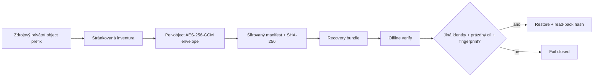

# Checkpoint FÁZE 11 – R08 object recovery základ

- **Datum:** 2026-08-02.
- **Výchozí commit:** `8ebd0e5`.
- **Hlavní výstupy:**
  [11-object-recovery-verification.md](11-object-recovery-verification.md) a
  [11-object-recovery-runbook.md](11-object-recovery-runbook.md).
- **Produkce:** nedotčena; bez produkční DB, secretů, storage, mailu,
  `modvoltapp.cz`, deploye a push.
- **Změny schématu:** žádná migrace ani změna dat.
- **Implementace:** šifrovaný object recovery bundle, autentizovaný manifest,
  úplná inventura privátního prefixu, safe distinct-target restore a operátorské
  CLI `identity/snapshot/verify/restore`.
- **Integrační důkaz:** lokální MinIO, 12/12 chráněných prefixů, oddělený source
  a target bucket, shodné klíče/SHA-256/`Content-Type`; úplný úklid.
- **Regrese:** typechecky, frontend 127/127, live-events 15/15, phase-relevant API
  285/285, oba buildy, lint a peers PASS; produkční audit 0, celý audit 1 Low.
- **Známý cizí fail:** celý API unit strom 290/291 kvůli stale field-navigation
  contractu proti uživatelsky rozpracovanému `layout.tsx`; ani jedna strana
  tohoto cizího diffu nebyla změněna.
- **R08 stav:** implementační základ dokončen lokálně, produkční provozní závazek
  otevřený.

## Architektura po FÁZI 11

DB backup zůstává vytvářen aplikačním `createBackup` jako šifrovaný objekt pod
privátním prefixem. Object recovery bundle jej zachytí spolu s fotografiemi,
přílohami a podepsanými dokumenty. Obnova objektů sama nikdy nespouští
`pg_restore`; DB se obnovuje následně do nové databáze a ověřuje aplikačním
restore/business smokem.

## Nejasnosti a otevřené otázky

- Který nezávislý účet/provider bude vlastnit off-site kopii a kdo smí měnit
  versioning/Object Lock/retenci.
- Požadované a reálně dosažitelné RPO/RTO, frekvence bundle a velikost největšího
  produkčního objektu/DB dumpu.
- Kdo drží current/old backup klíče, recovery kopii a dual-control oprávnění.
- Zda produkce používá S3 nebo GCS větev; GCS potřebuje vlastní integrační drill.
- Jak zajistit konzistentní bod při souběžných zápisech: provider versions,
  snapshot nebo krátké write-freeze okno.
- Kdo uzavře cizí field-navigation contract po dokončení rozpracovaného UX diffu.

## Jednoznačný checkpoint

FÁZE 11 je ukončena. Lokální R08 object recovery základ byl implementován a
ověřen; produkční off-site/immutable infrastruktura, RPO/RTO a key custody
nejsou tímto checkpointem schváleny ani dokončeny. Automaticky se nepokračuje.
Uživatelské rozpracované soubory mimo výše uvedený scope byly zachovány.

## Doporučení pro další spuštění

- **další fáze:** FÁZE 12 – staging a provozní uzavření R08/release-readiness;
- **doporučený model:** GPT-5.6 Sol;
- **doporučený reasoning:** xhigh;
- **důvod použití této úrovně:** fáze propojí bucket policy, versioning/Object
  Lock, oddělené identity, key custody, velké streaming payloady, staging DB +
  object restore, RPO/RTO a release abort/rollback hranice;
- **očekávané činnosti:** nejdřív schválit cílovou staging/off-site topologii,
  ověřit remote CI, nakonfigurovat nezávislý staging backup cíl, provést large
  object + DB restore a business smoke, změřit RPO/RTO, doplnit freshness alert
  a release checklist; produkci stále neměnit bez nového výslovného souhlasu;
- **soubory, které budou pravděpodobně změněny:** staging/CI konfigurace,
  infrastrukturní deklarace bucket policy/retence, recovery/release runbooky,
  případně `object-recovery.ts` pro streaming a izolované staging E2E testy;
- **zda další fáze může obsahovat migrace nebo jiné rizikové změny:** může měnit
  staging bucket policy, versioning/Object Lock, recovery credentials a aplikovat
  již existující migrace do jednorázové staging DB; nová produkční migrace,
  backfill, rotace produkčních secretů, deploy nebo zásah do `modvoltapp.cz`
  nejsou povoleny bez dalšího výslovného souhlasu.
