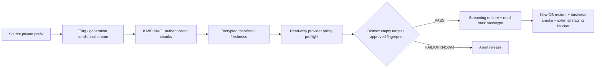

# Checkpoint FÁZE 12 – staging readiness a R08 operational gate

- **Datum:** 2026-08-02.
- **Výchozí commit:** `e9b05d7`.
- **Hlavní výstupy:**
  [12-verification.md](12-verification.md),
  [12-staging-readiness-matrix.md](12-staging-readiness-matrix.md) a
  [12-object-recovery-runbook.md](12-object-recovery-runbook.md).
- **Produkce:** nedotčena; bez produkční DB, secretů, storage, mailu,
  `modvoltapp.cz`, deploye a push.
- **Migrace/data:** žádná nová migrace, backfill ani změna produkčních dat;
  existující migrace 103/103 proběhly jen v odstraněné lokální PostgreSQL 18 DB.
- **Implementace:** streamovaný/chunkovaný recovery bundle v2 se čtením v1,
  conditional source read, stream restore/read-back, read-only storage preflight,
  freshness exit gate a izolovaný CI drill.
- **S3 důkaz:** 13/13 objektů včetně 67 109 121 B; všech 12 chráněných prefixů,
  oddělené versioned/Object-Lock-capable buckety, shodné hash/typ/metadata;
  úplný cleanup.
- **Kontroly:** typechecky, recovery 10/10, relevantní API unit 290/290,
  frontend 127/127, live-events 15/15, DB soubory 137/138 s jediným cizím
  contract failem, oba buildy, quality gate, YAML parse a diff check.
- **Vzdálený stav:** default branch `a25c312`, bez statusů/workflow run a bez
  `quality-gate.yml`; lokální CI změna nebyla publikována.
- **R08 stav:** lokální implementační gate dokončený; externí/provozní R08 a
  obecná release readiness zůstávají BLOCKED.

## Architektura po FÁZI 12

## Nejasnosti a otevřené otázky

- Který provider, účet a oddělený credential bude vlastnit off-site target.
- Zda cílová větev je S3 nebo GCS; GCS nemá reálný integrační drill.
- Kdo schválí Object Lock/locked retention režim a počet dní.
- Kdo drží current/old/recovery klíče, kdo smí provést break-glass a jak bude
  prokázán dual control.
- Jaká cadence a alert delivery garantují schválené RPO; kdo alert přebírá.
- Jaké RPO/RTO skutečně schválí vlastník (hodnoty v matici jsou jen návrh).
- Který anonymizovaný staging recovery point a business kontroly se použijí.
- Zda uživatel dokončí rozpracovaný field-navigation záměr rozšířením contractu,
  nebo vrácením tří cest.
- Kdy a s jakou autorizací mají být lokální commity/workflow publikovány, aby
  mohl proběhnout vzdálený CI run.

## Jednoznačný checkpoint

FÁZE 12 je ukončena. Lokální staging-readiness/R08 implementační balíček je
dokončen a ověřen; externí staging a produkční provozní závazek dokončeny nejsou.
Automaticky se nepokračuje. Produkční systémy ani remote nebyly změněny a cizí
rozpracované soubory byly zachovány.

## Doporučení pro další spuštění

- **další fáze:** FÁZE 13 – autorizovaná externí staging aktivace a end-to-end
  release evidence;
- **doporučený model:** GPT-5.6 Sol;
- **doporučený reasoning:** xhigh;
- **důvod použití této úrovně:** fáze propojí vzdálený CI, provider policy,
  oddělené identity, immutable retenci, key custody, společný DB + object
  recovery point, autentizované browser/mail/PWA scénáře a release abort hranice;
- **očekávané činnosti:** nejprve dodat/schválit staging URL, test identity, mail
  sandbox, source/off-site storage profily a RPO/RTO; autorizovaně publikovat
  lokální gate, ověřit zelený remote run, spustit přísný preflight, vytvořit
  čerstvý anonymizovaný recovery point, obnovit jej do nové staging DB/bucketu,
  provést business a browser E2E, změřit RPO/RTO a ověřit alert delivery;
- **soubory, které budou pravděpodobně změněny:** staging secret/config reference
  bez hodnot secretů, CI workflow, izolované staging E2E, monitor/freshness job,
  release/rollback runbook a FÁZE 13 evidence; cizí field-navigation contract jen
  po samostatném potvrzení UX záměru;
- **zda další fáze může obsahovat migrace nebo jiné rizikové změny:** ano, pouze
  v autorizovaném izolovaném stagingu může aplikovat již existující migrace,
  vytvořit/mazat test buckety a zapnout versioning/Object Lock/retenci, která může
  být nevratná; nový produkční schema change, produkční backfill, rotace secretů,
  push/deploy nebo zásah do `modvoltapp.cz` nejsou povoleny bez nového výslovného
  souhlasu.
