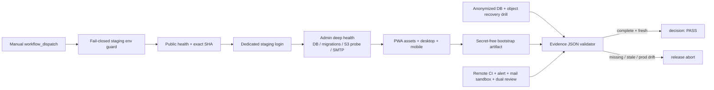

# FÁZE 13 – staging aktivace a release evidence

- **Datum:** 2026-08-02.
- **Výchozí commit:** `667f202`.
- **Rozsah tohoto běhu:** lokální staging aktivační balíček, fail-closed kontrakt,
  ruční non-deploy workflow, izolovaná read-only/deep-health browser sada a
  strojově ověřitelný evidence gate.
- **Mimo rozsah:** produkce, `modvoltapp.cz`, produkční DB/storage/mail/secrets,
  remote push, staging deploy a libovolný externí restore bez známých targetů.

## Centrální registr zjištění

| ID | Stav | Zjištění | Důkaz / dopad |
| --- | --- | --- | --- |
| F13-01 | potvrzeno | Workspace ani proces environment neobsahují staging URL, identitu, DB, storage ani mail sandbox handly. | Externí smoke/recovery nelze bezpečně adresovat; produkce není náhradní testovací target. |
| F13-02 | potvrzeno | Lokální `main` byl 41 commitů před `origin/main` a worktree obsahoval cizí rozpracované UI/schema změny. | Automatický push by publikoval neodsouhlasený rozsah; remote zůstal beze změny. |
| F13-03 | potvrzeno | Existující `e2e/global.setup.ts` používá `admin/admin` a konfigurace má localhost fallback. | Stávající suite není bezpečná pro externí staging; nová sada má povinné dedikované secrets a žádný fallback. |
| F13-04 | potvrzeno | `/api/healthz` prokazuje DB + migration parity, ale storage status deklaruje `ok` bez live storage sondy. | Release gate musí navíc volat autentizované `/api/admin/health`. |
| F13-05 | potvrzeno | `/api/admin/health` provádí live write/delete storage diagnostiku. | Workflow vyžaduje zvláštní explicitní potvrzení a oddělený target; není to čistě read-only request. |
| F13-06 | potvrzeno | Remote default branch zůstává na `a25c312`; nemá lokální quality/staging workflow ani status run. | Remote CI ani staging workflow v této fázi nebyly skutečně spuštěny. |
| F13-07 | vyřešeno lokálně | Chyběl jednotný formát, který sváže commit, CI, deploy, migration parity, recovery, PWA/mail/alert a dual control. | `check-staging-release-evidence.mjs` přijme pouze čerstvý kompletní záznam a odmítne secret fields či produkční URL. |

## Implementovaná architektura

Produkční aplikace ani API routy se nemění. Nové soubory žijí pouze v
`scripts/`, `e2e/staging/`, `.github/workflows/` a `docs/audit/`; root script
registry jen zpřístupňuje jednotlivé gate příkazy.

## Lokální ověření

| Kontrola | Výsledek |
| --- | --- |
| Workspace typecheck + `e2e/tsconfig.staging.json` | PASS |
| Hermetic + staging contract testy | PASS, 16/16 |
| Frontend unit | PASS, 127/127 |
| Live-events | PASS, 15/15 |
| API unit – celý aktuální worktree | PARTIAL, 295/296; jediný fail je cizí rozpracovaný field-navigation literal contract |
| API unit – bez známého cizího contract souboru | PASS, 290/290 |
| API build | PASS |
| Frontend/PWA build | PASS; `manifest.webmanifest` a `sw.js` vygenerovány |
| ESLint celý workspace | PASS, 0 warnings |
| Prettier phase files, JSON/YAML parse, `git diff --check` | PASS |
| Staging guard bez proměnných | PASS fail-closed, exit 1 |
| Staging guard s fiktivním `.test` targetem | PASS; výstup jen booleany/origin/SHA, bez identity a hesla |
| Playwright discovery s fiktivním targetem | PASS, 5 testů ve 3 projektech; `--list`, bez sítě a bez global setup |
| Evidence template | očekávaně FAIL do nahrazení `PENDING`; nesmí být použit jako release důkaz |

Hermetický orchestrátor prošel typecheckem a 16/16 guard testy. Jeho první
frontend spuštění zastavil sandboxový `esbuild` path traversal, nikoli test fail;
stejná suite následně mimo filesystem sandbox prošla 127/127. Databázové suite
nebyly opakovány, protože FÁZE 13 nemění API/DB/runtime schema a nepoužívá DB.
Dependency audit nebyl opakován, protože `pnpm-lock.yaml` ani dependency set se
nezměnily.

Lokální runner během kontroly začal relinkovat ignorovaný `node_modules` uvnitř
OneDrive. Závislosti byly offline obnoveny z existujícího store, funkčnost byla
znovu ověřena a neúplná 656MB cache v `tmp/` byla po přesném ověření odstraněna.
Verzované ani uživatelské soubory tato obnova nezměnila.

## Externí release matice

| Gate | Stav | Co chybí |
| --- | --- | --- |
| Publikovaný remote quality workflow na přesném SHA | BLOCKED | explicitní autorizace review/push a čistý publikovaný rozsah |
| Izolovaný staging deploy | BLOCKED | URL, environment owner, DB/storage/mail handly a deploy oprávnění |
| Authenticated API/deep-health smoke | BLOCKED | staging URL a dedikovaná identita |
| Desktop/mobile/PWA browser smoke | BLOCKED | nasazený staging commit a browser run |
| Provider policy + immutable target | BLOCKED | provider, target fingerprint, retence a schválení vlastníka |
| Společný anonymizovaný DB + object restore | BLOCKED | recovery point a nové staging DB/bucket |
| Mail sandbox delivery | BLOCKED | sandbox route/inbox |
| Freshness alert delivery | BLOCKED | monitor destination a on-call owner |
| Změřené a schválené RPO/RTO | BLOCKED | owner approval a skutečný external drill |
| Dvoučlenné finální evidence | BLOCKED | operator, reviewer a dokončené gate |

Lokální implementační připravenost není externí release evidence. Dokud nejsou
všechny řádky `PASS` a validator nevydá `decision: PASS`, obecný release zůstává
fail-closed.

## Nejasnosti

- Kdo poskytne a vlastní staging environment a kdo autorizuje publikaci lokální
  větve s desítkami nepublikovaných commitů.
- Jaký provider/bucket, retention režim a fingerprint budou schváleny.
- Který mail sandbox a alert channel lze bezpečně použít.
- Jaké RPO/RTO schválí service owner.
- Jak vznikne anonymizovaný, časově společný DB + object recovery point.
- Zda má být staging po game day smazán, nebo ponechán s placenou immutable retencí.
